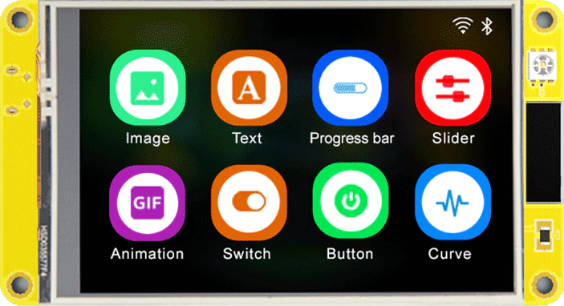
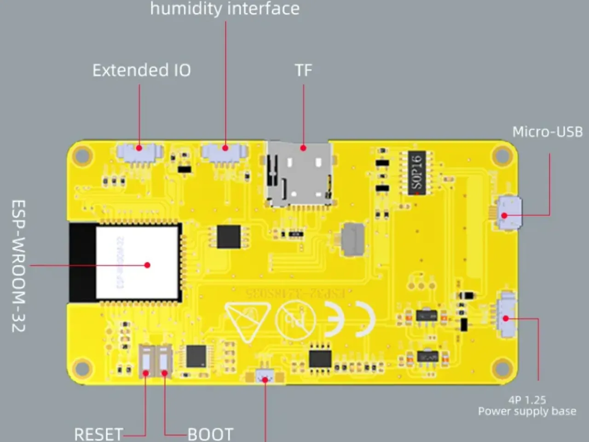
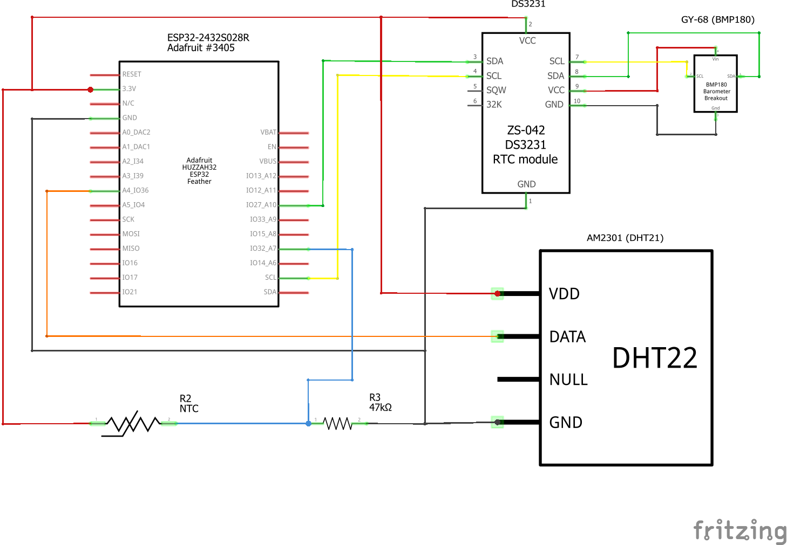
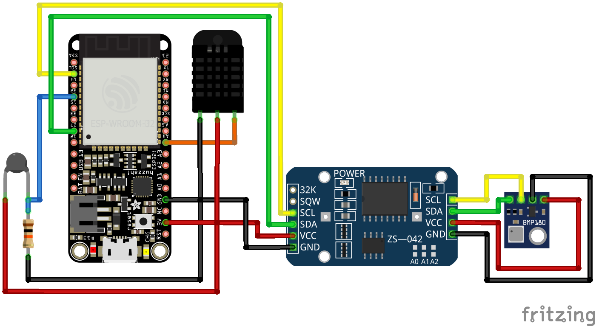
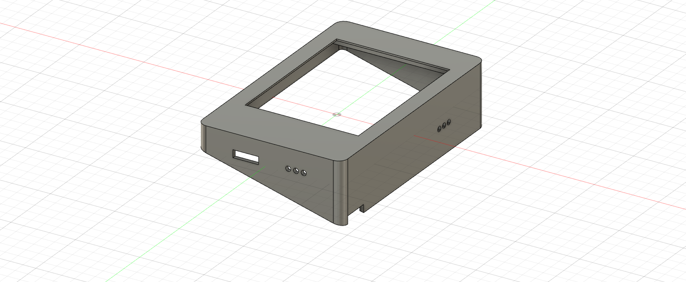
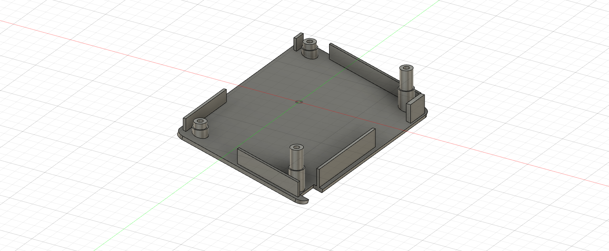

# ESP32 Clock & Temperature Circuit and Diagram for Ultralight Aircraft

This repository contains a simple blueprint, including schematics, diagrams and code for the installation of a Clock & Temperature display based on ESP32 on ultralight aircraft or for general aviation aircraft classified as experimental.

The board is available on AliExpress for decent prices and offer a lot.
They can be bought in the [Sunton Store](https://www.aliexpress.com/store/1100192306) on AliExpress but saw them also from other sellers.

- [ESP32-2432S028R - 2.8" 240x320 TFT Resistive touch](https://www.aliexpress.com/item/1005004502250619.html)
- [ESP32-3248S035R/C 3.5" 320x480 TFT Resistive/Capacitive touch](https://www.aliexpress.com/item/1005004632953455.html)

#### Circuit Diagram

#### Components

#### 3D Print Case

#### UI Example

