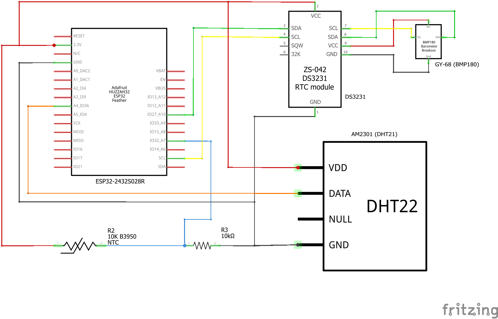
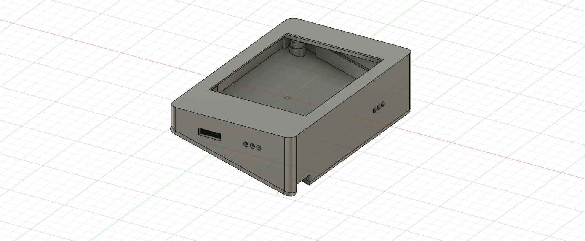
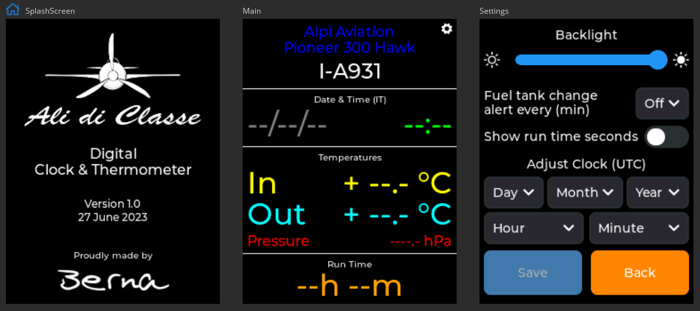

# ESP32 Clock & Temperature Circuit and Diagram for Ultralight Aircraft

This repository contains a simple blueprint, including schematics, diagrams and code for the installation of a Clock & Temperature display based on ESP32 on ultralight aircraft or for general aviation aircraft classified as experimental.

The board is available on AliExpress for decent prices and offer a lot.
They can be bought in the [Sunton Store](https://www.aliexpress.com/store/1100192306) on AliExpress but saw them also from other sellers.

- [ESP32-2432S028R - 2.8" 240x320 TFT Resistive touch](https://www.aliexpress.com/item/1005004502250619.html)
- [ESP32-3248S035R/C 3.5" 320x480 TFT Resistive/Capacitive touch](https://www.aliexpress.com/item/1005004632953455.html)


#### Circuit Diagram



#### Components


#### 3D Print Case
##### Front + Back

##### Front

##### Back


#### UI Example


### Code

The project can be edited with [Visual Studio Code](https://code.visualstudio.com) with [PlatformIO](https://platformio.org) extension installed.
The GUI is made with [SquareLine Studio](https://squareline.io)
This project depends on some standard libraries:
- SPI @ 2.0.0
- lvgl @ 8.3.7
- RTClib @ 2.1.1
- ESP32Time @ 2.0.0
- Timezone @ 1.2.4
- Adafruit Unified Sensor @ 1.1.9
- Adafruit BMP085 Library @ 1.2.2
- DHT sensor library @ 1.4.4
- EEPROM @ 2.0.0

To use the LVGL library, a lv_conf.h file is required to define the settings for LVGL.
The provided ```lv_conf.h``` file should be copied in the LVGL library at ```.pio/libdeps/esp32dev/lvgl/lv_conf_template.h```.

To remove CPU usage and FPS count set ```#define LV_USE_PERF_MONITOR 0``` in  ```lv_conf.h```
To remove used memory and the memory fragmentation set ```#define LV_USE_MEM_MONITOR 0``` in  ```lv_conf.h```
